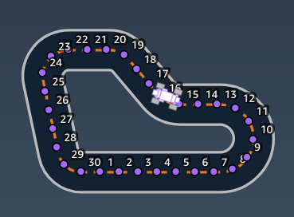
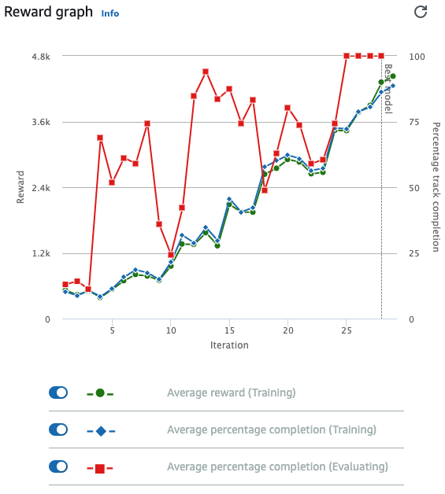

# AWS DeepRacer

Documentation of my AWS DeepRacer model. Model done during AWS DeepRacer event held at Sanoma. Creation of a model and training of the model was sponsored by AWS.

Model was trained on `re:Invent 2018 - Counterclockwise` track.

Race type is `Time trial`.

## Planning:

The model was inspired when scanning through the provided parameters. The parameter `waypoints` caught my eye and decided to use `closest_waypoints` parameter as my base:

Image above is from `re:Invent 2018 - Counterclockwise` track and shows the tracks waypoints.

## Model

As the model I used the waypoints graph to my advantage to train the model.
Main focus was using `closest-waypoints` parameter and staying on the center line.

See `model.py` to see the model.

Action space used:

| No.         | Steering angle (°) | Speed (m/s) |
| ----------- | ------------------ | ----------- |
| 0           | -30                | 1.00        |
| 1           | -30                | 1.50        |
| 2           | -30                | 2.00        |
| 3           | -15                | 1.00        |
| 4           | -15                | 2.00        |
| 5           | -15                | 3.00        |
| 6           | 0                  | 2.00        |
| 7           | 0                  | 3.00        |
| 8           | 0                  | 4.00        |
| 9           | 15                 | 3.00        |
| 10          | 15                 | 2.00        |
| 11          | 15                 | 1.00        |
| 12          | 30                 | 2.00        |
| 13          | 30                 | 1.50        |
| 14          | 30                 | 1.00        |

Training time was 200 minutes.

## Evaluation in virtual environment

Completed three laps in 00:37.784 seconds.

| Trial       | Time (MM:SS.mmm) |
| ----------- | ---------------- |
| 1           | 00:12.059        |
| 2           | 00:13.465        |
| 3           | 00:12.326        |

## Evaluation in real environment

Completed one lap in 00:18.387 seconds.

| Trial       | Time (MM:SS.mmm) |
| ----------- | ---------------- |
| 1           | 00:18.387        |